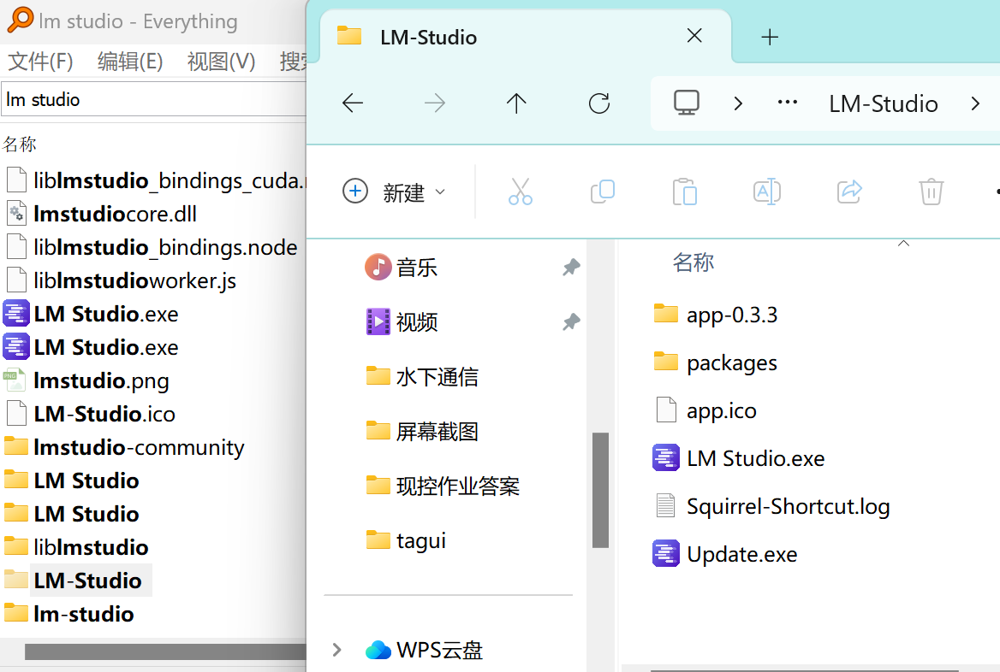
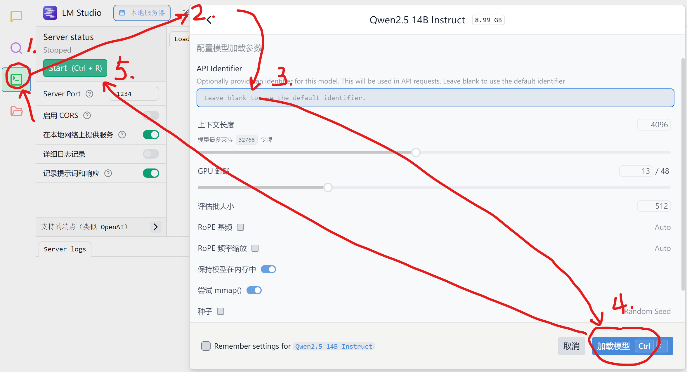
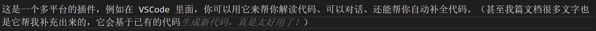

很久没追踪AI相关的产品和技术了，今天心血来潮，介绍三款非常值得使用的AI相关产品。

# LM Studio

## 介绍

如果你经常到github上搜寻AI项目、跟随潮流，你一定会萌生一个念头。为啥啥 AI 应用都要去调 OpenAI 的 API 呀，我可没这么多钱去买tokens，你多想有一个本地模型啊。但是如果你是一个小白，你可能知道有Ollama呀之类的本地大模型，但你大概是不知道怎么去使用它们。LM Studio就是一个解决此问题的，它里面搜集了各类开源的本地模型，小的有1B，大的有72B，都是**免费无限使用**的！

你可以在LM Studio用这些模型（相当于你有了一堆不同的AI）对话 ，也可以用这些本地大模型建立本地服务器，用在绝大多数需要OpenAI API的他人开发的AI项目中（例如等一下要讲到的两个项目）。

## 下载和使用

下载安装很简单，到官网（这是外网）（https://lmstudio.ai/）选择自己操作系统适配的下载，双击直接安装。

关键点在于进入之后，你会发现没有模型可以用！原因是这个软件是国外的，因此里面链接的模型都是huggingface（外网）的。你需要修改它：

1. 用Everything找到 lm Studio，

2. 用 VS Code 打开此文件夹，左侧放大镜搜索`huggingface.co`全替换为`hf-mirror.com`。

好了，关掉再打开肯定就可以显示了，但在这之前不妨先在右下角设置一下使用“中文”吧。再在左下角选择开发者模式。然后你就可以愉快地选择模型下载了，建议用`4B`及以上的模型，当然对应体积也比较大。哦，别忘了，如果你c盘空间不够，务必先到左侧最下面的按钮这里更改位置，再下载模型（涉及到文件夹存放层级的问题）。

## 使用LM Studio作为本地模型服务器

这个功能是为了满足一些其他人开发的 AI 引用需要 API 的情况。例如你开发了一个 AI 项目，需要用到 OpenAI 的 API，但是你又没有钱买 API 或者 API 调用次数不够，这时候你可以用 LM Studio 作为本地模型服务器，然后在你的 AI 项目中引用本地模型。

先在最底下选择开发者模式，左侧有一个绿色的按钮，进入服务器配置页面，在最顶上载入模型（建议模型名称，即API identifier，为空白）。然后左侧按钮点击 start 。

下面勾选在本地网络提供你的服务会更改你的服务器地址，会从127.0.0.1改为xxx.xxx.xxx.xxx（你的局域网IP地址）。

## Fitten Code

这是一个多平台的插件，例如在 VSCode 里面，你可以用它来帮你解读代码、可以对话、还能帮你自动补全代码。（甚至我篇文档很多文字也是它帮我补充出来的，它会基于已有的代码） 

真是有点自恋了，哈哈哈↑。主要是它是免费（目前），不需要用 OpenAI API 。