import { Tabs, TabItem } from '@astrojs/starlight/components';
import { Card, CardGrid } from '@astrojs/starlight/components';

晶体管是最重要的一种有源元件，它能放大输入信号。不同于无源器件的升压变压器，晶体管能实现功率放大，输出信号增大的功率来自晶体管外接供电电源。**功率增益器件具有的一种显著的特征是，通过从其输出端反馈一定的输出信号至输入端可以构成一类振荡器。**

晶体管还是一种有效的接口电路，可用于集成电路与其他电路之间或一个子电路与另一个子电路之间。

> 本书探讨晶体管工作原理的方式也与其他许多教材中的方式大不相同。常见的方法是用 h 参数模型与等效电路来描述分析。而我们认为这些是不必要的复杂且非直观的方法。这是因为人们对电路特性的理解不仅仅是那些由复杂方程推导出的东西，更重要的是自己对电路如何发挥作用的理解，并且我们也常常并不关心晶体管的哪一个特性参数可以值得信赖，**更主要的是看哪一个参数能在大范围内变化**。

> 本章将推出一个非常简单的晶体管概述模型来蔡代传统的研究方法，并利用该模型估算一些电路。不久，还会揭示它的应用受限性。接着，我们将扩展这一模型并介绍著名的 Ebers-Moll 方程。采用 Ebers-Moll 方程和简单的三端模型，将会更好地掌握晶体管，并且无需做大量的计算。尤其独特的是，这些设计大部分不依赖于不易控制的晶体管参数，如电流增益。

工程标记法

晶体管各极对地电压用单下标表示，例如：

- $V_C：集电极电压$

两极之间的电压用双下标表示，例如：

- $V_{BE}：基极与发射极之间的电压$
- $V_{CC}：表示与集电极相连的 (正) 电源电压$
- $V_{EE}：表示与发射极相连的 (负) 电源电压$

### 2.1.1 第一种晶体管模型：电流放大器

<Card title="晶体管">
    晶体管泛指一切以半导体材料为基础的单一元件，包括各种半导体材料制成的二极管 (第一章) 、三极管、场效应管 (第3章) 、晶闸管（后三者均为三端子）等。但该书本章的晶体管仅限于三极管，后续我将用更准确的“三极管”来表述。它通常有 NPN 和 PNP 两种形式。
    
    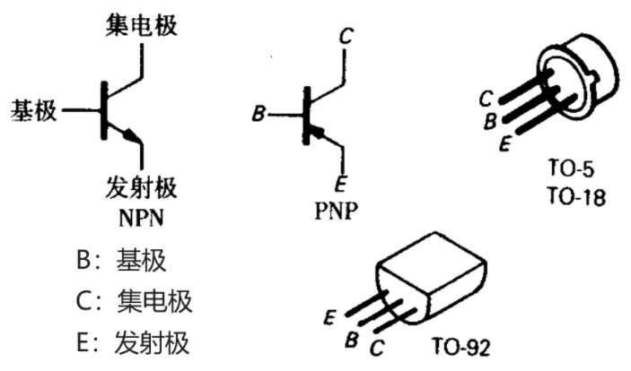

    对于 NPN 三极管需要满足如下供电特性：
    1. 集电极电位必须高于发射极电位。
    2. 基极 -发射极与基极 -集电极的电路特征表现就像二极管一样，通常基极-发射极间的二极管正向偏置，处于导通状态；而基极-集电极间的二极管处于反向偏置，显然此反向电压阻止其电流通过。
    3. 对于任何一个三极管而言，它的 IC、IB、VCE 总有最大值，还有一些功耗 ( ICVCE ) 、温度和 VBE 的限制。总之，确保晶体管安全工作。
    4. 当满足上述三个规则时，( 第2点确保三极管在放大状态 ) IC 近似于 IB 成正比。

    
$I_C=h_{FE}I_B=\beta I_B$

    hFE 是电流增益，典型值是 100 左右。但它不是一个值得信赖的晶体管参数。对于不同晶体管类型，值可在 50~250 之间变化。它还依赖于集电极电流、集电极与发射极间的电压和工作温度。**如果一个电路仅依赖于 hFE 的一个特定值，那它必定不是一个好电路。**

    注意，晶体管集电极电流并非由“二极管”导通而形成，[详解](https://www.zhihu.com/question/34534183/answer/137383173)。
</Card>

## 2.2 几种基本的三极管电路

### 2.2.1 三极管开关

下图是简易的开关电路，当按下开关后，基极电位抬升，必然使发射极正向导通。此时三极管必定不在**截止状态**，基极-发射极压降约为 0.6V。基极电阻上有`10V-0.6V`的电压，电流为 9.4mA 。假设三极管处于放大状态，放大 100 倍后可得通过灯的电流为 940mA ，明显大于 100mA ，灯正常工作分去 10V 电压，集电极电位接近 0V ( 典型的饱和电压大约为 0.05~0.2V ) ，低于基极电压 ( 集电极正向导通 )，不满足放大状态的条件。说明此时为**饱和状态**，不能用放大状态的电流公式计算，也说明该方法过度激励了基极电流 ( 实际 1mA 即可)。

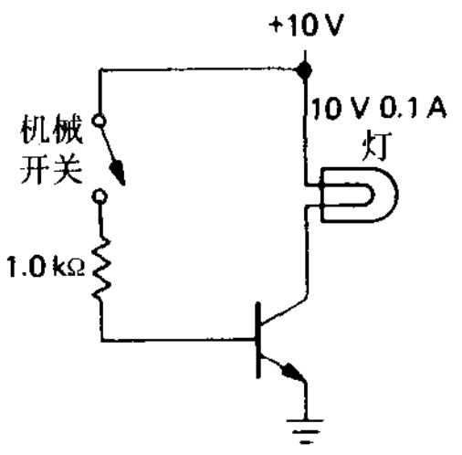

晶体管开关能使电路迅速地通断, 通常在微秒的几分之几数量级。 同样, 也可只用单一的控制信号来控制许多不同的电路。还有一个优点是可利用晶体管开关实现线控转换，即原先开关连接传输信号的导线可能存在损失，而该电路中开关仅控制*通断信号*。

:::tip[设计：三极管开关]

设计时需要注意：

1. 慎重地选择基极电阻以便使基极激励电流较大, 尤其是在激励灯泡时, 还需考虑在低 V CE处**减小的 β 值**。对于高速开关转换，由于容性效应，以及在高频 ( 许多兆赫 ) 工作时对应的 β 值也会减小，因此更需注意考虑这一点。通常，**一个较小的加速电容可连接在基极电阻两端，以便改进电路的高速特性**。
2. 通常在基极和地之间接一个电阻 ( 在图中电路中，大约 10kΩ ) ，以便开关断开是基极处于地电位，并且也不影响开关接通的运行状态，因为它只会从基极电流中分流 0.06mA。
3. 当负载由于某种原因使集电极电流变化到地电位以下时 ( 例如，由交流激励或是感性的 )，通常在**集电极与电源之间串联一个二极管** (或者集电极与地之间反接一个二极管 ) 以防止集电极 - 基极在负电压范围内导通。
4. 对于感性负载，用一个二极管与该负载并联，以便保护晶体管。 ( 参阅 [1.7.7 节](../chap1/#177-感性负载与二极管保护) )

:::

### 2.2.2 射极跟随器

:::tip[设计：射极跟随器]
    如图所示，发射极电位跟随基极的输入，只比基极低一个二极管压降。

    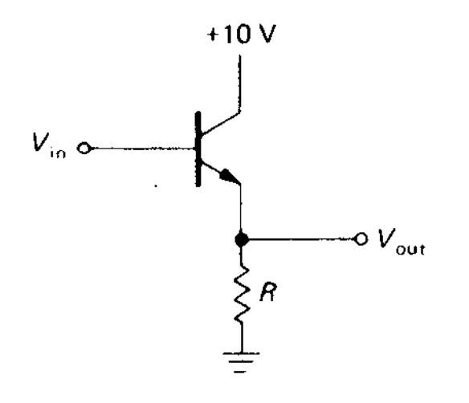
:::

**射极跟随器的意义**：有较小的输出阻抗[^1] ( 类似戴维南等效内阻增大 ) 防止出现[负载效应](../chap1/#125-戴维南等效电路)。但如果下一级的输入阻抗[^2]是常数，则没有必要计较负载效应，因为可以量化。

**证明**：若基极有一个电压变化量`△V`，则发射极会有对应的变化量，发射极电流为：

$\triangle I_E=\triangle V_B/R$

因此

$\triangle I_B=\frac{1}{h_{fe}+1}\triangle I_E=\frac{\triangle V_B}{R(h_{fe}+1)}$

$r_{in}=\frac{\triangle V_B}{\triangle I_B}=(h_{fe}+1)R$

hfe ( β ) 典型值为100，因此连接在发射极的较低阻抗的负载在基极处看起来就像高得多的大阻抗。( 除了很高频率工作外，小信号增益 hfe 约等于直流增益 hFE ，一般不做区分) 我们容易得到一个具有源内阻 Zsource 驱动时的输出阻抗：

$Z_{out}=\frac{Z_{source}}{h_{fe}+1}$

由于射极跟随器具有这些较好的特性, 所以已在许多场合中得以应用。例如, 制成电路中 ( 或在输出端 ) 的一个**低阻抗信号源**；由一个较高阻抗的参考源 ( 例如由分压器构成的 ) 转换成一个严格陡峭的参考电压源，以及将信号源与下一级的负载隔离。

:::caution[注意：不适用 Zout远小于 Zin的情况]
Zout：上一级等效阻抗；Zin：下一级的输入阻抗。

该条件是解决负载效应来确保信号源的线性度的。不适用的情况有二：
1. 射频电路中，通常偏爱阻抗匹配 Zout=Zin
2. 当级间耦合的信号是电流不是电压时，恰恰相反，必须尽力使 Zin 远小于 Zout ( 对于电流源，Zout=∞)
:::

#### 关于射极跟随器的几个要点

1. 射极跟随器中的 NPN 三极管只能产生拉电流[^3]。如图所示，因为小负载和发射极电阻构成分压器钳位在 -5V ，因此灌电流[^4]也被“钳”住了。**对于小信号输出阻抗值较小 ( 即放大区时的输出阻抗 ) 并不意味着在低负载电阻上能产生大信号**。当射极跟随器包含自己的电压源或电流源时，这种问题也会随之出现。这种情况最常出现在稳压电源中，这时其输出是一个射极跟随器，并且用于驱动一个有其他电源的电路。

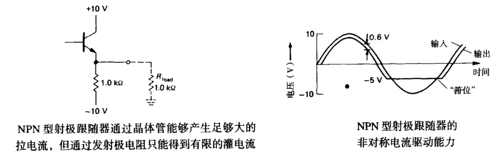

解决该问题的两种方法，或者采用PNP晶体管( 如果所有信号都只是负回的)，以便减小发射极电阻 ( 在大发射极电阻与晶体管上损耗较大的功率 ) ；或者采用“推挽”结构，在这种电路中采用两个互补的晶体管 ( 一个NPN，一个PNP，参见 2.4.1 节 )。 

1. 硅晶体管的基极与发射极间的反向击穿电压较小, 通常只有 6V。而足够大的输入变化范围会使晶体管处于反向截止状态, 并容易导致击穿 ( 也导致和rs的减小) 为了克服这一缺点，可加上二极管保护电路。

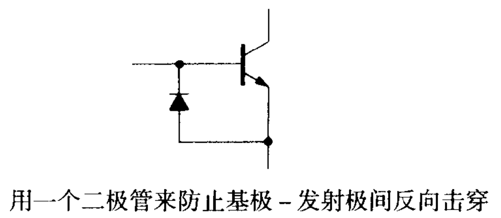

1. 基极-发射极间电压降并不是一个常数，稍微依赖于集电极电流。

### 2.2.3 射极跟随器作为稳压器

先介绍最简单的稳压器：齐纳二极管，如图所示。齐纳二极管需要一定的电流，考虑**最差情形设计**，因此可以选择

$\frac{V_{in}-V_{out}}{R} > I_{out}$

电路中的齐纳二极管必须能够损耗：

$P_{zener}=(\frac{V_{in}-V_{out}}{R}-I_{out})V_{zener}$

再次考虑最差情形设计，需采用 Vin(max) 、 Rmin 与 Iout 。

二极管稳压源有时用于一些不太重要的电路，即一些**只需要小电源电流**的场合。原因：

1. Vout 不可以调整。
2. 齐纳二极管只有有限动态阻抗，只能对波纹及由输入或负载引起的变化稍加抑制。
3. 对于负载电流变化较大的场合，有必要采用一个高功率齐纳二极管，以便应付负载电流的功率损耗。

:::tip[设计：改进的稳压器]

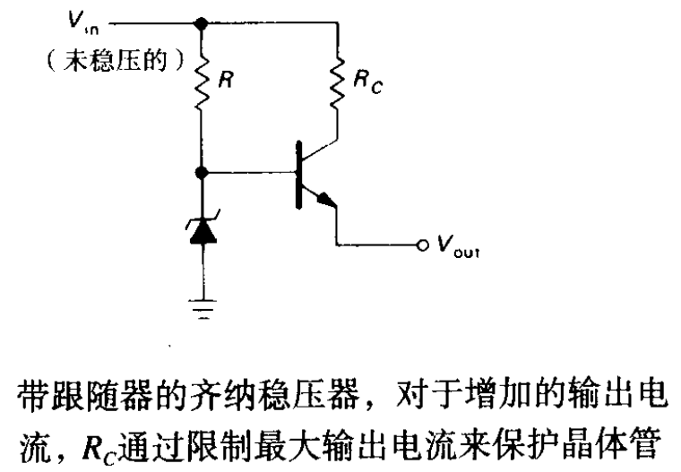

稳压器的输出电压等于齐纳二极管的电压减去晶体管的基极-发射极电压，即 UZ − UBE，其中 UBE 通常对于硅晶体管来说约为 0.7V。

假设由于外部负载减小导致输出电压下降，因为 UZ 不变，由基尔霍夫电压定律定律可知， UBE 会增加，这会进一步打开晶体管并提供更多电流以增加负载电压。反之，负载增大的情况，会导致电流减小以维持输出电压。

另外 RC 的设计应当注意在最高正常负载电流时，其两端压降仍然小于 R 两端压降 ( 即确保三极管处于放大状态 ) 。
:::

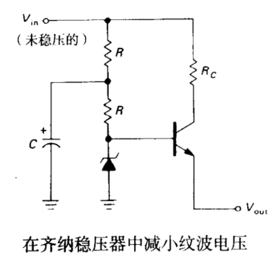

消除流经 R 的波纹电流对齐纳电压的影响，可以用一低通滤波器，R 提供足够大的齐纳二极管电流，C 确保滤除高于 `1/RC` 频率的电流。

### 2.2.4 射极跟随器偏置

1. 因为有电容，所以一定是无直流成分，正负均可的
2. 设置合适的静态工作点，使得正负最值的范围对称，防止波形钳位。常见的设计方案会让分压器分一半电压，这是考虑到 0.6V 比较小的情况，下面的方案则尽可能准确设置静态工作点。

射极跟随器设计

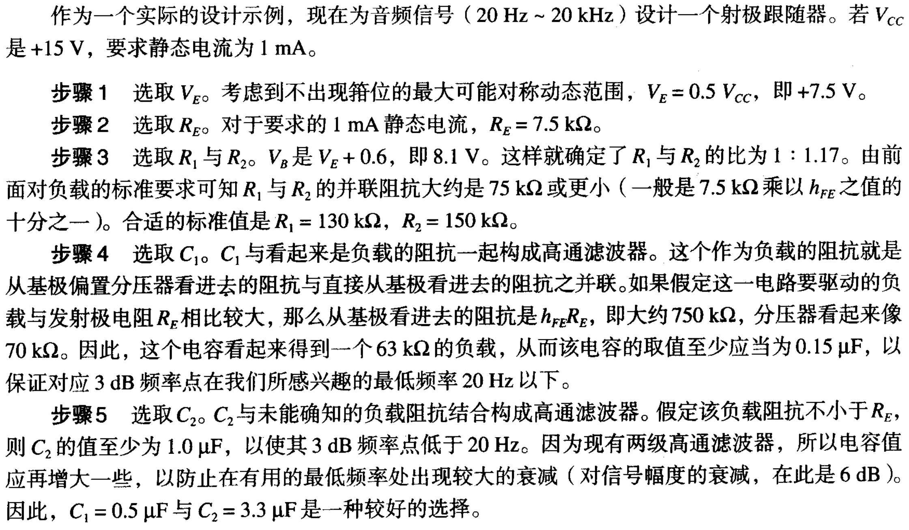

步骤5的 1μF 的计算可以用`f=1/(2πRC)`求得。0.5 和 3.3 可能要用波特图之类的计算。

1. 分压器仍然要考虑负载效应，因此三极管的输入阻抗，必须远大于分压器的输入阻抗，即两电阻并联的阻值。

$R_1||R_2 << h_{FE}R_E$

#### 双电源供电的射极跟随器

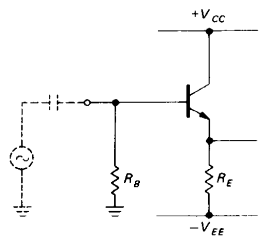

因为信号是接近“地”的，我们也可以采用双电源供电的射极跟随器，但注意基极不能直接接信号，需要有直流通路确保三极管稳定工作在静态工作点。

:::danger[错误：不能这样设计射极跟随器]

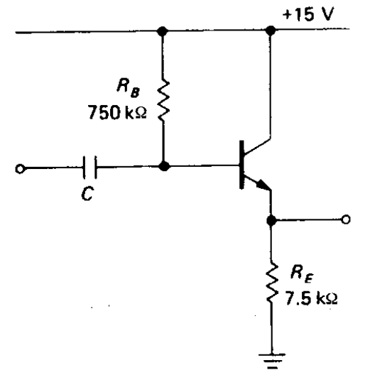

根据假定的放大倍数，如 100倍，估算基极电流，然后根据需要的动态范围去计算 RB 。这会导致电路对放大倍数很敏感，但事实上 β 很容易因各种因素而变化。但分压器对此则不敏感，即时 hFE 为 200 ，发射极电压相较 100 也仅有 5% 的变化。

:::

### 2.2.5 晶体管电流源

<Card title="电流源的应用">
- 晶体管的一种极好的偏置
- 超增益放大器的“有源负载”与差分放大器的发射极电流源
- 积分器、锯齿波发生器与斜坡发生器
- 放大器与稳压器电路中能提供宽电压范围的正偏
- 需要恒定电流源的场合，如电离子渗入法与电化学等
</Card>

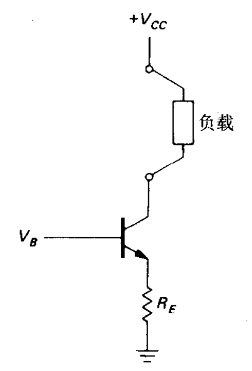

在三极管不处于饱和的状态下，产生的电流可以用如下公式计算：

$I_C\approx (V_B - 0.6)/R_E$

#### 电流源偏置电路

给基极提供偏压有许多方案，下面是其中三种：

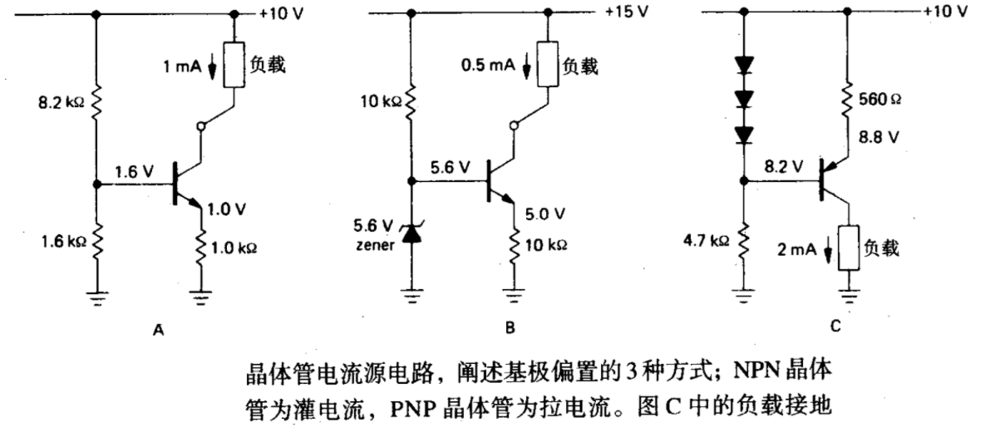

#### 电流源的适用范围

电流源只能在确定的负载电压范围内给负载提供恒定的电流。在电流源输出特性良好的范围内，对应的输出电压称为电流源的输出**适用范围**。例如上 C 图负载电压范围可以为 0~8.6V 。适用范围计算时需要注意集电极-发射极击穿电压和过量的功率的功率损耗。

电流源在基极不一定需要一个固定的电压，通过改变 VB 能得到电压可控的电流源，但输入信号变化范围 vin ( 小写字母符号意味着**交流变化量** ) 必须保持足够小，以确保发射极电压不会降至零，使输出电流能平稳地反映输入电压的变化。这种结构是这样一种电流源, 它的输出电流的变化与其输入电压的变化成正比，即 iout=vin/RE 。

#### 电流源的缺陷

晶体管电流源不是理想电流源主要由以下两个原因造成：
1. VBE ( [Early效应](https://blog.csdn.net/weixin_43233653/article/details/139668965) ) 与 hFE 随集电极-发射极电压稍由变化。
2. VBE 和 hFE 受温度影响，输出电流受温度变化而漂移。

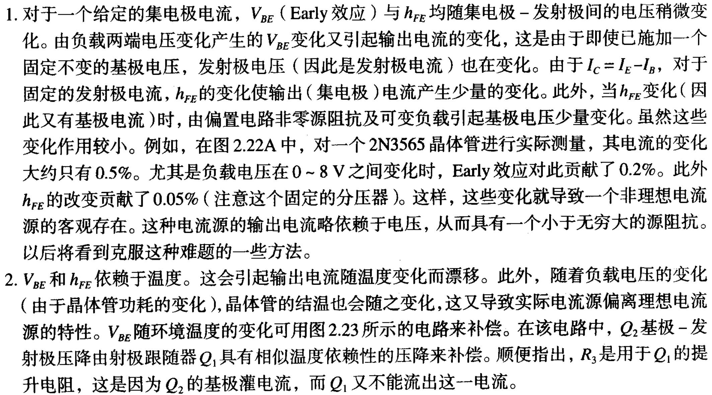

#### 改进电流源的特性

:::tip[设计：改进的三极管电流源]
针对缺陷 1 中的 Early 效应有两种方案：固定住 VCE ；固定住 VBE 。下图分别对应这两种方案，前者还能消除 VBE 受温度影响产生的变化，但对器件有精度要求。

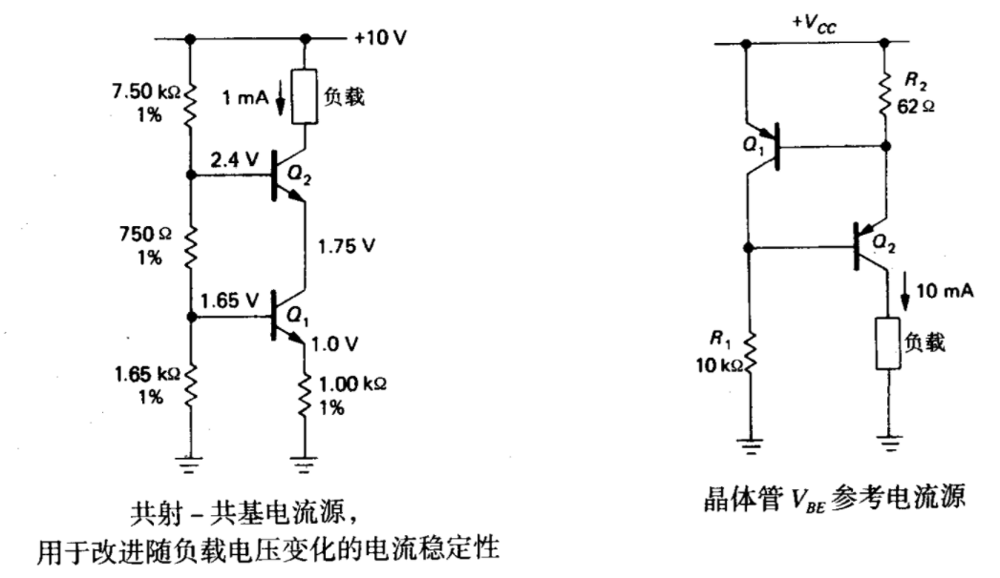

再给出一种解决缺陷 2 的温度补偿方案：

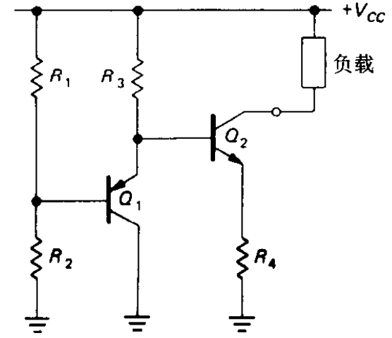
:::

### 2.2.6 共射极放大电路

-----

[^1]: 输出阻抗：指一个电路或设备在输出端口处所呈现的阻抗。输出阻抗相当于一个电阻（或阻抗）与外部电路的连接。
[^2]: 输入阻抗：指一个电路或设备在输入端口处所呈现的阻抗，相当于一个电阻（或阻抗）与输入端口的连接。
[^3]: 拉电流：从模块输出到负载的电流，电路向某点提供正电位。
[^4]: 灌电流：从信号源流向模块的电流，电路向某点提供零电位或负电位。

