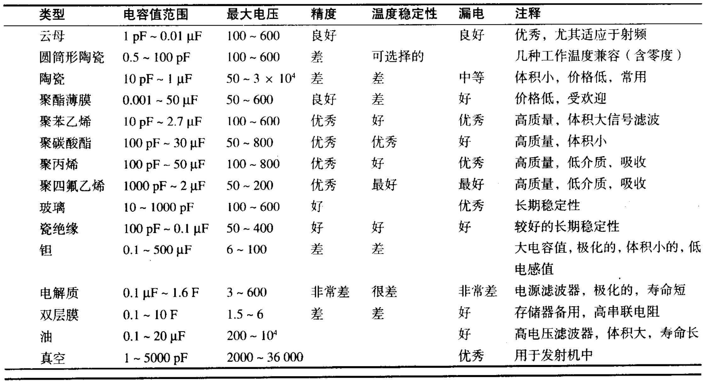
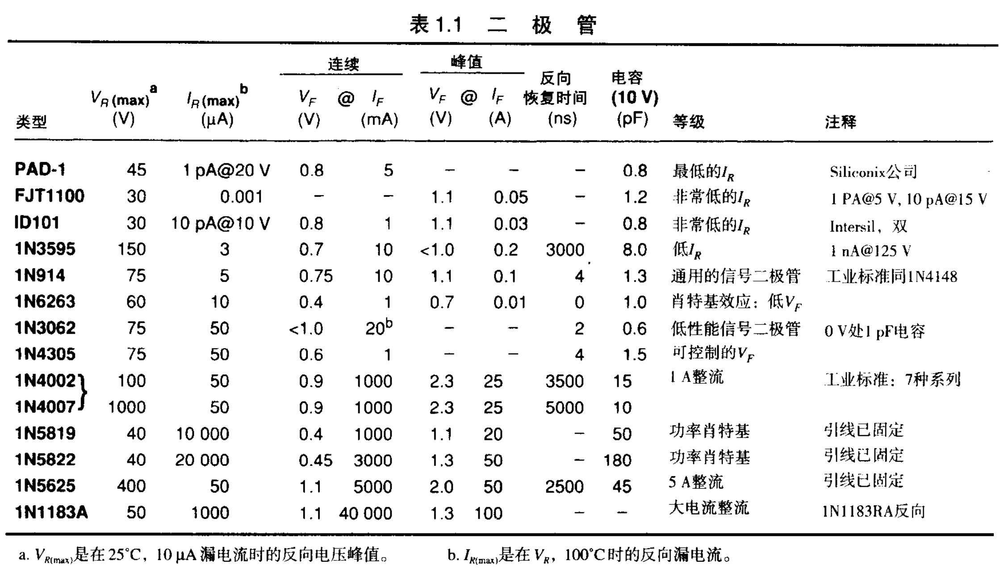
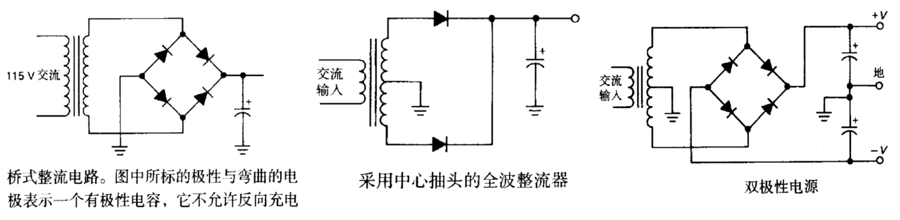
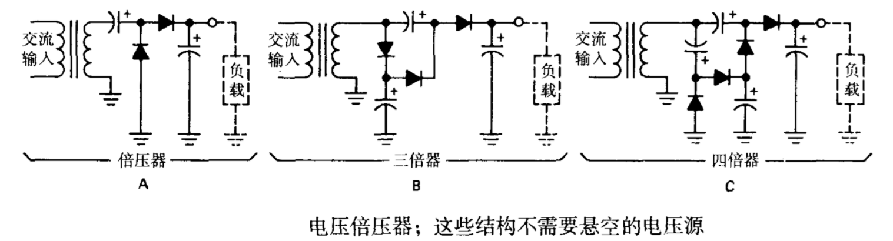

import { Tabs, TabItem } from '@astrojs/starlight/components';
import { Card, CardGrid } from '@astrojs/starlight/components';

本章首先研究电路的定律、准则以及一些构成电子学技术的重要技巧。在此, 我们有必要从电压、电流、功率以及构成电子电路的元件谈起。

## 1.2 电压、电流和电阻

### 1.2.2 电压与电流之间的关系：电阻

<Card title="电阻">
电阻在电子电路中的应用非常广泛。
- 在放大器中, 它被用做有源器件的负载、偏置电路或反馈元件。
- 它与电容结合使用即可形成时间常数, 并作为滤波器使用。
- 它也可用于设置工作电流与信号电平。 
- 电阻用于在电源电路中损耗功率，以减小相应电压，也用于测量电流以及在电源撤去后使电容放电，还用于在精确电路中建立电流，提供准确的电压比，以及设置准确的增益值。
- 在逻辑电路中，电阻作为总线和线路终端以及“上拉”与“下拉”电阻。
- 在高压电路中，电阻用于测量电压与均衡串接中的二极管或电容的泄漏电流。
- 在射频电路中，电阻甚至可以用来作为线圈，以取代电感。
</Card>

<Tabs>
  <TabItem label="电阻串联">
    $R=R_1+R_2$
  </TabItem>
  <TabItem label="电阻并联">
    $R=\frac{R_1R_2}{R_1+R_2}\quad或\quad R=\frac{1}{\frac{1}{R_1}+\frac{1}{R_2}}$
  </TabItem>
  <TabItem label="功率公式">
    $P=I^2R$
  </TabItem>
</Tabs>
---

### 1.2.3 分压器

 $I=\frac{V_{in}}{R_1+R_2}$ 

 $$V_{out}=IR_2=\frac{R_2}{R_1+R_2}V_{in}$$ 

分压器常用于从一个较大且固定的 ( 或变化的 ) 电压中产生一个特定的电压值。

### 1.2.4 电压源和电流源

一个理想的电压源是一个二端黑匣子，不管所接的负载电阻如何，两端的输出总是一个恒定的电压。而现实中的电压源只能供给一个有限的电流。并且，它通常表现为一个理想电压源与一个小电阻串联的特性，显然这个串联电阻越小, 电压源的特性就越好。

一个理想的电流源也是一个二端黑匣子。不管所接的负载电阻与所加的电压如何，总保证电路输出一个恒定的电流。为了达到这一点, 电流源两端必须能够输出所需的任何电压。现实中的电流源总有一个输出电压的限定值，又称**容量**。

一个电池可视为是对电压源的实际近似(而对电流源则无近似)。

万用表

通常有较多的仪器用于测量电路中的电压与电流。**示波器**就是最通用的一种。它能让我们看见电路中一个点或多个点随时间变化的电压。**逻辑探测仪**与**逻辑分析仪**则属于数字电路中排除故障的专用仪器。简单的万用表则提供了一种能以较高精度测量电压、电流与电阻的便利途径。然而，万用表的反应速度慢，它不可能替代示波器用于那些要关注电压变化的场合。现在，万用表有两大类型：用移动的指针在常规刻度盘上显示测量结果，或采用数字显示。

### 1.2.5 戴维南等效电路

戴维南定理指出，任何一个具有电阻与电压源连接的二端口网络可以等效成一个电阻R与一个电压源Y串联的电路。这是一个非常重要的定理。 任何一个含有多个电源与电阻的复杂网络可以用只含有一个等效电压源与一个等效电阻串联的电路来等效模拟 ( 还有另一个定理，即诺顿定理。它指出类似的情形，可用只含有一个等效电流源与一个等效电阻并联的电路来模拟 ) 。

 $$V_{Th}=V_{开路电压}$$ 

$$R_{Th}=V_{开路电压}/I_{短路电流}$$

如果用于分压电路，则有：

 $V_{开路电压}=V_{in}\frac{R_2}{R_1+R_2}$ 

 $\quad I_{短路电流}=\frac{V_{in}}{R_1}$ 

因此，戴维南等效电路是一个电压源：

 $V_{Th}=V_{in}\frac{R_2}{R_1+R_2}$ 

 $R_{Th}=\frac{R_1R_2}{R_1+R_2}$ 

一个分压器不是一个很好的电压源，因为它的输出电压随负载接入而严重下降。要解决这个问题，可以在分压电路中采用较小的电阻，但通常最好还是采用晶体管或运算放大器等有源器件构造 ( 第2~4章讨论 ) 。这种方法很容易构成内阻仅为毫欧极的电压源，而且方便调整输出电压。

**电路加载效应**：信号源外接负载的阻值较小导致开路电压 ( 或信号 ) 下降的现象，应当尽力使**_负载电阻远大于等效内阻_**。

### 1.2.6 小信号电阻

有这样一类电子器件，流经它的电流 I 并不与其两端电压 V 成比例。在这类情
况中, 由于比值 V/I 取决于 V，而不是一个独立于 V 的常数值，因此没有多大必要再去谈论电阻值。然而，对于这些器件的分析通常是了解它们的 V-I 曲线的斜率，即一个器件上所加电压的微小变化与流过该器件上的电流的微小变化之比: **dV/dI** 。这种定义具有电阻的量纲 ( Ω ) ，并且在许多相应计算中取代了电阻的含义。这类器件又称为**小信号电阻**、**增量电阻**或**动态电阻**。

#### 齐纳二极管

电流变化较大时，电压变化相对小，可以电压不变，动态阻值依据电流而定。

#### 隧道二极管

隧道二极管又称为江崎二极管，其有一个负增量电阻。一个由电阻和隧道二极管组成的 分压器其实是一个**放大电路** ( 上右图 ) 。

## 1.3 信号

### 1.3.1 正弦信号

正弦信号恰好是描述自然界许多现象以及**线性电路特性**的微分方程的解。线性电路特性可以用如下式子表示：

$O(A+B)=O(A)+O(B)$

正弦波激励的线性电路总输出一个正弦波响应，但相位和振幅一般会变化。

**频率响应**：用于描述电路的特性，指[增益随频率的变化曲线](https://baike.baidu.com/item/%E9%A2%91%E7%8E%87%E5%93%8D%E5%BA%94/1545234?fr=ge_ala)。原文 _“电路使输出正弦波的幅度特性随输入正弦波频率的函数关系而改变”_。

:::note[拓展：关于信号频率]
- 一个高度保真的放大器应当具有一个至少在20Hz~20kHz频率范围内的“平坦”的频率响应。

- 我们通常处理从几赫兹到几兆赫兹的正弦频率信号。更高频率的信号涉及到微波技术，惯用的导线电路不再适用，取而代之的是较不稳定的[波导](https://baike.baidu.com/item/%E6%B3%A2%E5%AF%BC/1224480?fr=ge_ala)或[微波传输线](https://www.elecfans.com/d/2333328.html)。
:::

### 1.3.2 信号幅度与分贝

描述正弦波的幅度有三种方法：
- 幅度 ( 用A表示 )
- 峰-峰值 ( 用pp表示 ) ：2倍幅度值
- 均方根值 ( 用rms表示 ) ：仅对正弦波有0.707A的关系，用于计算功率。

#### 分贝

比较信号幅度，因为信号之间可能有上百万倍的大比值，幅度值相除不便，采用对数则较简单。定义分贝：

$dB=20lg\frac{A_2}{A_1}$

也可以用信号功率表示 ( 不限于正弦，是另一种定义式 ) ：

$dB=10lg\frac{P_2}{P_1}$

若 A2 幅度为 A2 两倍，则对应分贝数 6dB；若是 A2 是 A1 的十倍，则为+20dB。相反则为负。

尽管分贝数用于规定两信号的比值，但有时也用做对幅度的绝对衡量。例如，[dBV、dBm](https://www.zhihu.com/question/20349736/answer/3245448532)、[dB SPL](https://blog.csdn.net/GUMU12345/article/details/135240337)、dBrnC等。用这些方式表示幅度时都需要有一个参考量，计算绝对分贝数时，就将**相应的参数的值与参考量之比代替幅度比值**。

### 1.3.3 其他信号

**噪声**：常源于热随机噪声。电压特性可以用他的功率谱密度 ( 每赫兹是哪个的功率 ) 或它的振幅分布来描述。一种常见的噪声是**带限高斯白噪声**，它的功率谱密度函数在某一频率范围内是相等的，且对噪声电压的振幅进行大量即时测量时，振幅满足高斯分布。这种噪声是由电阻产生的 ( [Johnson噪声](https://baike.baidu.com/item/%E7%BA%A6%E7%BF%B0%E9%80%8A%EF%BC%8D%E5%A5%88%E5%A5%8E%E6%96%AF%E7%89%B9%E5%99%AA%E5%A3%B0/22800983?fr=ge_ala) )。

**方波**：上升时间在几纳秒到几毫秒之间，上升时间定义为信号的总过渡转换量的10%~90%之间的时间。

**脉冲**：由脉冲振幅和脉冲宽度定义。对一系列均匀间隔的脉冲串，我们定义**占空比**为脉冲宽度与周期之比(0~100%)。书中定义与[百度-脉冲](https://baike.baidu.com/item/%E8%84%89%E5%86%B2%E6%B3%A2/2730791?fr=ge_ala)有所不同。

### 1.3.4 逻辑电平

只关心区别高低状态的门限电平。

### 1.3.5 信号源

#### 信号发生器

信号发生器就是正弦波振荡器，它通常给出一个宽频率范围内的信号 ( 典型输出范围为50 kHz~ 50 MHz ) ，并且有精确的幅度控制装置 ( 通常采用一个称为衰减器的电阻分压器 ) 。信号发生器还可用来调节输出 ( 参见第13章 ) 。

:::note[拓展：扫频仪和信号发生器的区别]
[扫频仪](https://baike.baidu.com/item/%E6%89%AB%E9%A2%91%E4%BB%AA?fromModule=lemma_search-box)产生的信号会随着时间的推移而改变频率，它能够测试无线电器件以检测它们对不同频率的响应。而信号发生器则主要产生单一频率或多个固定频率的信号，用于测试或校准各种类型的电子设备。
:::

信号发生器的另一种变化形式是频率合成器。这种装置能产生频率被精确设置的正弦波信号。频率的设置是数字化的,常常是8位数字或更多，并按照一个精确的标准 ( 石英晶体振荡器 ) 根据9.5中的数字方法进行合成。如果要更精确的，需要利用频率合成器。

#### 脉冲发生器

只产生脉冲信号，宽度、频率、振幅、极性和上升时间等可调。有可编程系列。

#### 函数发生器

最灵活的信号源，可得到正弦波、三角波与方波函数，典型频率范围是0.01Hz~10MHz。它们也可以用于脉冲输出，并且有一些还有调制装置。有可编程系列。

## 1.4 电容和交流电路

### 1.4.1 电容

<Card title="电容">
  浅层理解：电容是一个依赖频率的电阻元件，这样就可以构成一个依赖频率的分压电路。在旁路、耦合等应用场合就要用到这一点。
  
  更深层：电压和电流是正交的 ( 90°相位差 ) ，所以电容不会损耗功率。与电容电流有关的功率没有转化为热量，而是存储在电容内部电场中。
  
  电容的基本结构就是两块道题相互接近，但不触碰。一般地，陶瓷与聚酯薄膜类用于大多数不太重要的电路中; 钽电容用于需要较大电容量的场合, 而电解质电容则用于电源滤波的场合。

  

  
电容类型总结表

  该表仅为简要比较，有一定主观性。
  
  

</Card>

<Tabs>
  <TabItem label="电容定义式">
    $Q=CV$
  </TabItem>
  <TabItem label="推导式">
    $I=C\frac{dV}{dt}$
  </TabItem>
  <TabItem label="电容并联">
    $C_{total}=C_1+C_2+C_3+…$
  </TabItem>
  <TabItem label="电容串联">
    $C_{total}=\frac{1}{\frac{1}{C_1}+\frac{1}{C_2}+\frac{1}{C_3}+…}$
  </TabItem>
</Tabs>
---

#### 1.4.2 RC电路：随时间变化的V与I

简单RC电路得到：

$C\frac{dV}{dt}=I=-\frac{V}{R}$

该微分方程的解为：

$V=Ae^{-t/RC}$

**时间常数**：t=RC。

**5RC经验准则**：在5倍时间常数内，一个电容充电或放点至最终值的1%以内。

对于任意的输入电压，输出电压是什么？

$V(t)=\frac{1}{RC}\int_{-\infty}^tV_i(\tau)e^{-(t-\tau)/RC}d\tau$

RC电路用一个加权因子对过去的输入求平均。

:::tip[设计：延时电路]
CMOS 缓冲器在输入是“高电平”的情况下输出“高电平” ( 它通常高于供给电路的直流电压的一半 ) ; 反之，输入为“低电平“，则输出也为“低电平”。 前面的缓冲器提供一个与输入信号完全相同的信号, 但具有较低的源输出内阻，以防止由 RC 电路引起的输入加载。

图中10ms是依据 RC 电路在0.7RC时间内即可达到70%的输出。但该延时电路不建议大量使用。

:::

### 1.4.3 微分器

$I=C\frac{d}{dt}(V_{in}-V)=\frac{V}{R}$

令RC足够小，则有

$V(t)=RC\frac{d}{dt}V_{in}(t),\(dV/dt<<dV_{in}/dt)$

微分器可以很好地检测脉冲信号的**前沿**和**后沿**。

:::caution[故障：不需要的容性耦合]

- 第一种情况是一个方波在电容某处被容性耦合至我们关心的信号通路上造成的。这意味着这个信号通路上缺少一个电阻负载。
- 第二种情况是遇到一个方波输入，但在电路某处断开，通常是示波器探头断开，中断处的小电容与示波器的输入电阻相结合构成一个微分电路。
:::

### 1.4.4 积分器

$I=C\frac{dV}{dt}=\frac{(V_{in}-V)}{R}$

通过让RC乘积较大，来得到：

$V(t)=\frac{1}{RC}\int_0^tV_{in}(t)dt+C,\(V<<V_{in})$

当研究运算放大器与反馈时，可以不受公式括号内条件的限制来构造积分器,它们可以在宽频率与大电压范围内以很小的误差进行工作。

积分器已被广泛地运用于模拟计算中。作为一种有用的电子电路，它也在反馈控制系统、模/数转换与波形产生等方面有着重要的应用。

:::tip[设计：斜坡发生器]

用一个恒流源对电容充电即可产生一个斜坡电压波形。

$V(t)=(I/C)t$

:::

## 1.5 电感与变压器

### 1.5.1 电感

<Card title="电感">

电感中的电流变化取决于它两端所加的电压。在电感两端加一电压会引起电流以斜坡函数的形式上升。[( 对于电容则相反 )](./#144-积分器)

与电感电流有关的功率没有转化为热量，仍然以能量的形式存储在电感的磁场中。

**电感在射频电路中用途最多**。它作为射频扼流圈成为调谐电路的一部分(参见第13章)，而一对紧密耦合的电感又可构成非常有用的变压器。

公式：

$V=L\frac{dI}{dt}$

</Card>

### 1.5.2 变压器

[变压器](https://baike.baidu.com/item/%E5%8F%98%E5%8E%8B%E5%99%A8/565082?fr=ge_ala)是一种包含两个紧密耦合线圈的装置,这两个线圈分别称为初级与次级。在其初级加一交流电压, 会引起次级电压出现。次级电压以变压器匝数比的倍数 ( 正比 ) 增加，而对应的次级电流则与匝数比的倍数成反比。匝数比将次级的阻抗变换至初级并呈 n2 倍出现。

**两个用途：改变电压和电流到有用的值；将电子设备与电源线的链接进行隔离。**

变压器还可以用于音频和射频场合。一般用于高频场合的变压器要用特殊的磁芯材料或结构来减小对信号传输的损失。

## 1.6 阻抗与电抗

电容和电感都是线性元件。线性有一重要特性为，**由某个频率 f 的正弦波激励的线性电路的输出本身也是同频率的正弦波 ( 至多改变了其幅度与相位 )** 。

利用该特性，我们可绘制出针对某一电路的**频率响应图**，其反映每一频率的正弦波的输出与输入之比。以某一放大器的扬声器举例，我们希望它具有平坦的响应特性，即关于频率的声压图形在音频频带范围内是一个常数，则可以将一个具有逆响应的无源滤波器用于音频放大器中，以弥补缺陷。

我们可以推广电阻的概念到“阻抗”，阻抗 = 电阻 + 电抗 ( 电容和电感具有的 ) 。对由复杂波形激励的电路进行分析涉及到微分方程或将复杂波形分解为正弦波分量的傅里叶分析法。以下的讨论只考虑由单一正弦波激励的电路。

### 1.6.1 电抗电路的频率分析

考虑一个输出正弦信号的电压源与一个电容形成的电路，其电流满足：

$I(t)=C\frac{dV}{dt}=C \omega V_0cos \omega t$

只考虑振幅则有：

$I=\frac{V_0}{1/ \omega C}$

它表现为一个依赖于频率的电阻`R=1/ωC`但实际的电流和电压相位差90°。

#### 电压和电流的复数表示

$V(t)=Re(Ve^{j \omega t})=Re(V)cos \omega t-Im(V)sin \omega t$

$I(t)=Re(Ie^{j \omega t})=Re(I)cos \omega t-Im(I)sin \omega t$

#### 电容和电感的电抗

对于一个电容，采用`I=C(dV/dt)`，得到：

$I(t)=-V_0C\omega sin\omega t=Re(\frac{V_0e^{j\omega t}}{X_c})$

其中电容在频率`ω`处的电抗为：

$X_c=-j/\omega C$

同理用[电感定义公式](./#151-电感)分析电感得：

$X_L=j\omega L$

#### 欧姆定律的推广

$I=V/Z$

$V=IZ$

<Tabs>
  <TabItem label="串联公式">
    $Z=Z_1+Z_2+Z_3+…$
  </TabItem>
  <TabItem label="并联公式">
    $Z=\frac{1}{\frac{1}{Z_1}+\frac{1}{Z_2}+\frac{1}{Z_3}+…}$
  </TabItem>
  <TabItem label="阻抗公式">
    $Z_R=R$

    $X_c=-j/\omega C$

    $X_L=j\omega L$
  </TabItem>
</Tabs>

对于多联通电路，**基尔霍夫定律**同样适用：一个闭合电路中的电压降 ( 复数 ) 为0，；流入一个节点处的电流 ( 复数 ) 为0。

- **电容电流相位超前电压相位90°**。
- **电感电压相位超前电流相位90°**。
- **如果只关心振幅，则将欧姆定律中各项取模**。

#### 电抗电路中的功率

$P=Re(VI^*)=Re(V^*I)=VIcos \phi $

上公式为平均功率 ( 有功功率 ) ，`V`和`I`均为均方根值。`*`表示取复数的共轭。`φ`为电压与电流之间夹角。

[**功率因数**](https://baike.baidu.com/item/%E5%8A%9F%E7%8E%87%E5%9B%A0%E6%95%B0/1016945?fr=ge_ala)是有功功率与视在功率的比值，即上式中的`cosφ`，取值从 0 ( 纯电抗电路 ) 至 1 ( 纯电阻电路 ) 。

$功率因数=\frac{平均功率}{|V||I|}$

:::note[拓展：功率因数的重要性]
功率因数在**大容量电源功率输送分配**中显得非常重要，是因为电抗电流虽不造成有用的功率损耗，但它们仍然以 I2R ( 其中 R 为发电机变压器与传输线的电阻 ) 的形式使其发热，从而损耗了电力公司的大量功率。虽然电力公司只要求居民用户付“实”功率 Re(VI*), 但它对工业用户则[按功率因数来收费](https://baike.baidu.com/item/%E5%8A%9F%E7%8E%87%E5%9B%A0%E6%95%B0%E8%B0%83%E6%95%B4%E7%94%B5%E8%B4%B9/5212006?fr=ge_ala)。这就能解释通常在大型工厂后面能看到的电容场地，它们是用来抵消工业机器 ( 如电动机 ) 中的感性电抗的。
:::

#### 分压器的推广

将分压器中的电阻更换为阻抗，即 R 换成 Z 即可。

### 1.6.2 RC滤波器

#### 高通滤波器

$I=\frac{V_{in}}{R-j/\omega C}=\frac{V_{in}[R+(j/\omega C)]}{R^2+1/\omega ^2C^2}$

$V_{out}=IZ_R= \frac{V_{in}[R+(j/\omega C)]R}{R^2+1/\omega ^2C^2}$

只关心它的幅度：

$V_{out}=(V_{out}V_{out}^*)^{1/2}= \frac{R}{[R^2+1/\omega ^2C^2]^{1/2}}V_{in}$

工程中常用-3dB作为滤波器的“截止点”，输出约为输入的0.707倍。在高通滤波器中，-3dB截止点由下式决定：

$f_{3dB}=1/2 \pi RC \quad 或 \quad \omega _{3dB}=1/RC$

当频率小于上述值时可以视为低频，不通过；高于此时为高频，通过。

电容不让稳定直流 ( f=0 ) 电流通过，其作为**隔直电容**也是最频繁的用途之一。

:::tip[设计：电容耦合]
高保真音频放大器的输入就采用该电路。由于不知道输入附加了多大的直流，因此用该方法隔直通交，并且滤除不需要的低频部分。 设计时应考虑：
- `1/RC`大小满足滤波所需的频率
- 使`R`尽可能远小于负载电阻 ( [加载效应](./#125-戴维南等效电路) )
:::

#### 低通滤波器

将高通滤波器的R和C互换记得到具有想法频率特性的滤波器：

$V_{out}=\frac{1}{(1+\omega ^2R^2C^2)^{1/2}}V_{in}$

3dB点与高通滤波器相同`f=1/2πRC`

低通滤波器在实际应用中非常普遍。例如，低通滤波器可用于消除来自附近电台与电视台的干扰 ( 550kHz~800MHz ) 。这种干扰一直是困扰音频放大器与其他灵敏度较高的电子设备的大问题。

因为先有激励后有响应（因果关系），所以幅度响应和相位响应存在一定关系 ( [维基-Kramer-Kronig关系](https://en.wikipedia.org/wiki/Kramers%E2%80%93Kronig_relations) ) 。

:::caution[注意：微分器/积分器——高/低通滤波器]
从电路上看，微分器与高通滤波器完全相同，[积分器](./#144-积分器)与低通滤波器完全相同。但**微分器的工作条件为输出信号频率低于3dB，良好的积分器则需要高于3dB**。

以微分器为例，假设输入信号 Vin 是`sinωt`，则有：

$V_{out}=\omega RC cos\omega t$

要满足微分器的条件 ( 输出电压远小于输入电压 ) 则需要`ωRC << 1`，即 3dB 截止条件。同理，对积分器可推导得`ω/RC << 1`。
:::

:::note[拓展：为什么没见过RL滤波器？]
RL也可以组成高/低通滤波器，但电感比电容笨重、价格昂贵，特性也不如电容好。

只有一种例外场合，即高频电路中，常采用扼流圈，可在不同位置安置铁氧体磁珠，使之略呈感性，提高阻抗，以防止“振荡”。扼流圈既有阻抗又有感抗，无须像RC滤波器中附加电阻。[**高频扼流圈**](https://baike.baidu.com/item/%E9%AB%98%E9%A2%91%E6%89%BC%E6%B5%81%E5%9C%88/1385991?fr=ge_ala)就是这样来的。
:::

### 1.6.3 相位矢量图

阻抗可以用矢量相加来理解。

先前，我们引入了电流和电压的复数表示，但在计算时并不够方便，完善[此公式](./#电压和电流的复数表示)：

$u(t)=\sqrt{2}Ucos(\omega t+\theta )=Re(\sqrt{2}Ue^{j\theta}e^{j\omega t})=Re(\dot{U}e^{j\omega t})$

其中`U`表示电压的有效值，在计算时需要掌握的是`u(t)`与极坐标表示法的 U ( 常用三角表示法 ) 的互相变换。

$\dot{U}=\sqrt{2}Ue^{j\theta}=U_m\angle \theta$

阻抗、电流同样可以用该三角表示法表示。**加减遵循矢量相加减的原则；乘除 ( 欧姆定律 ) 则遵循极坐标半径相乘除，角度相加减的原则**。

$\dot{Z}=\frac{U_m\angle{\theta _1}}{I_m\angle \theta_2}=Z\angle{(\theta_1-\theta_2)}$

相关[例子](https://zhuanlan.zhihu.com/p/345546880)可以查阅电路基础相关书籍。

由此戴维南定理也可以进行推广，任何包含电阻、电容、电感与信号源的二端网络均可等效为一个复阻抗与一个信号源的串联。

### 1.6.4 “极点”与每二倍频的分贝数

RC低通滤波器中，当 ω 较大 ( 远离拐点，可以忽略公式中的 1 ) 时，其每翻一倍，振幅就减半，也就是-6dB。我们称简单的RC滤波器具有 **6dB/二倍频** 的降落特性。用多个RC环节构成滤波器就可以得到12dB/二倍频 ( 两个RC环节 ) 等。

原书中此处未展开说明“极点”，详细可查看信号处理相关书籍。

:::caution[注意：多级滤波器]
关于多级滤波，不能通过简单级联几个完全相同的滤波器得到这些单个滤波器啊应的级联。理由是每一级都是前一级的负载, 从而会改变整个响应。记住, 关于简单RC滤波器的响应函数是基于一个零 ( 输出 ) 阻抗的激励源与一个无限大阻抗 ( 开路 ) 的负载而推导出的。解决方法：
- 使每一级滤波器具有比前一级高得多的阻抗
- 采用有源电路 ( 如晶体管或运算放大器 ) 级间“缓冲器"，即有源滤波器 ( 第 2 章至第5章 ) 
:::

### 1.6.5 谐振电路与有源滤波器

考虑图中电路，用阻抗计算公式可以得到：

$Z_{LC}=\frac{j}{(1/\omega L)-\omega C}$

与电阻结合形成分压器。当`f=1/2π√LC`时，阻抗为无穷大，使得该频率点上的响应值为一个峰值。

实际上，电容和电感的损耗会限制峰值的尖锐度，但有时会故意加入一个电阻以减少谐振峰值的尖锐度。这种电路就是 **LC 并联谐振电路**，即**谐振电路**。激励该电路的阻抗越高 ( 理解为串联的 R 变大，要使并联的阻抗远大于 R 就要更接近于谐振频率的f ) ，曲线峰值越尖，因而通常不用一些类似于电流源的信号源来激励。**品质因数 Q** 是对响应曲线峰值尖锐度的衡量， 等于 -3dB 处的频率宽度除以谐振频率。对于并联RLC电路，`Q=ω0RC`。

另一种 LC 电路是串联 LC 电路。`Q=ω0L/R`。**这两种电路都主要用于射频电路**。

### 1.6.6 电容的其他作用

<Card title="电容其他作用">

**旁路**：

- 原理：阻抗随频率升高而降低
- 条件：某支路只需要直流 ( 或缓慢变化的 ) 信号，而不需要变化的交流信号
- 方法：并联在那个支路两端，旁路交流信号

**电源滤波**：
- 作用：去除[**整流**](./#172-整流)后残余的交流成分，得到直流
- 方法：用大电容 ( 容量大、体积大 ) 旁路

**定时与波形形成**：见[延时电路](./#141-电容)。

</Card>

## 1.7 二极管与二极管电路

### 1.7.1 二极管

<Card title="二极管">
  二段无源非线性元件，具有单向导通特性。

  反向电流是纳安数量级的。反向击穿电压不同二极管有所不同，1N914 典型的反向击穿电压为 75V 。常用二极管正向压降，在 0.5V~0.8V之间。

  

  注意二极管不具有电阻，**当电路中有非线性的器件时，不能进行戴维南等效**。
  

  
二极管参数表

  
  

</Card>

### 1.7.2 整流

整流将交流 ( 电流方向会变化，图中即正负变化 ) 变为直流。

### 1.7.3 电源滤波

上述整流的效果因为波纹 ( 稳定在电压值周围做周期性变化的成分 ) 存在而不太理想。利用低通滤波器可以设法平滑这些波纹成分。图中串联的 R 其实可以省略 ( 有时会存在一个较小的电阻用来限制峰值整流电流的 ) ，理由是二极管能防止电流从电容流回，电容比传统滤波器更能作为储能元件，电容值选择：`RC >> 1/f`， R 为负载电阻。

经过低通滤波后的波纹电压可以这么理解，当整流器输出的电压高于电容器两端电压 ( 输出电压 ) 时，电容器充电直到相等，而后由于整流器输出电压降低，电容器会稍放电，输出电压略微降低，如图所示。波峰峰峰值可以按下式计算：

$\triangle V=\frac{I_{load}}{C}\triangle t$

其中 △t 在半波整流中用`1/f`，在全波整流中用`1/2f`。

:::caution[注意：电源整流计算]
把放电起始段当做斜坡已经相当精确，没有必要用更精确的指数放电公式，因为：

1. 仅当负载时电阻性的，放电才会是指数型的。
2. 电容进度通常是20%或更高，考虑到制造差异，**设计时可以尽量保守，即允许元件的最差情形组合**。
:::

### 1.7.4 电源的整流器结构

:::tip[设计：常用电源整流器]

采用中心抽头的全波整流器比较差，因为变压器次级每一半只在一半时间内被利用，发热量是全波桥式整流平均发热量两倍。其成本高，对应的电源体积笨重。
:::

:::tip[设计：倍压器]

:::

Read more <a href="../../../guides/example/">about</a> Astro!

