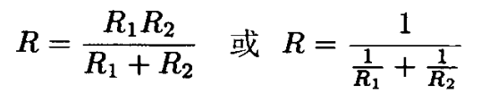

import { Card, CardGrid } from '@astrojs/starlight/components';

<Card title="电阻">
电阻在电子电路中的应用非常广泛。
- 在放大器中, 它被用做有源器件的负载、偏置电路或反馈元件。
- 它与电容结合使用即可形成时间常数, 并作为滤波器使用。
- 它也可用于设置工作电流与信号电平。 
- 电阻用于在电源电路中损耗功率，以减小相应电压，也用于测量电流以及在电源撤去后使电容放电，还用于在精确电路中建立电流，提供准确的电压比，以及设置准确的增益值。
- 在逻辑电路中，电阻作为总线和线路终端以及“上拉”与“下拉”电阻。
- 在高压电路中，电阻用于测量电压与均衡串接中的二极管或电容的泄漏电流。
- 在射频电路中，电阻甚至可以用来作为线圈，以取代电感。
</Card>

