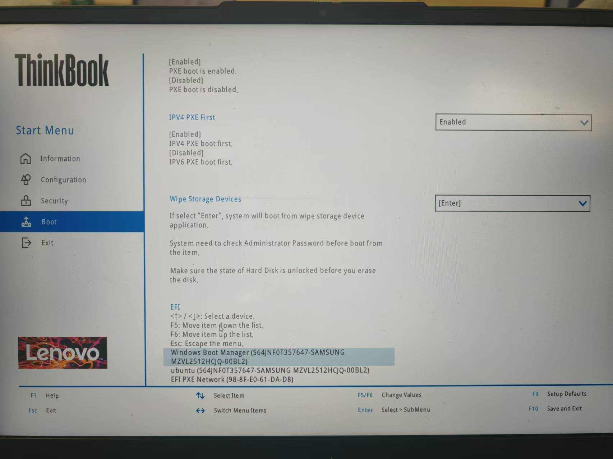
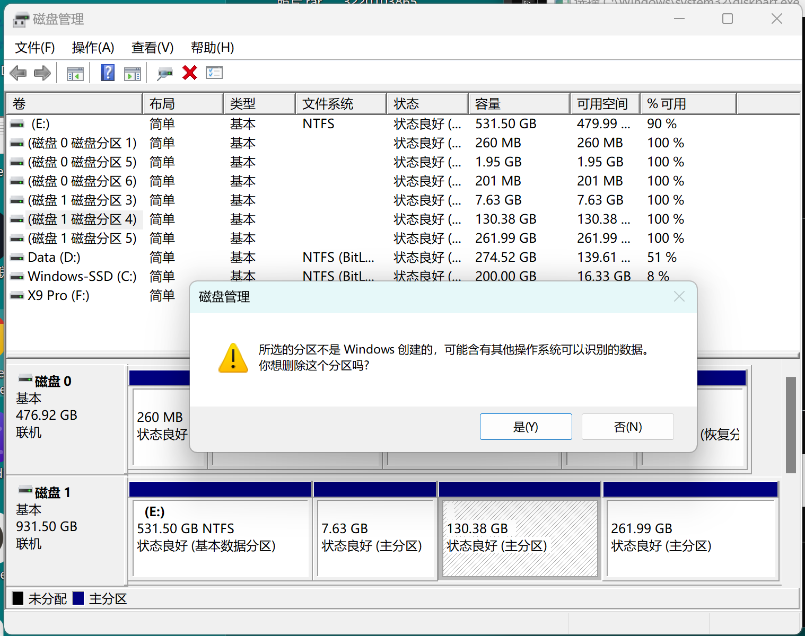
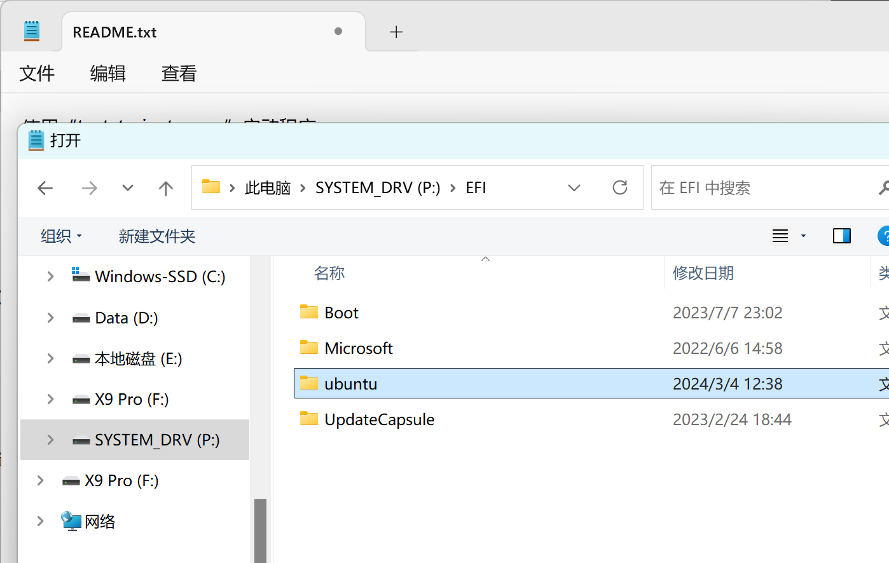

:::note[说明]

教学资源：[地址](https://ysyx.oscc.cc/docs/#%E6%95%99%E5%AD%A6%E8%B5%84%E6%BA%90)

| 预学习阶段 | 2 | https://ysyx.oscc.cc/docs/2306/preliminary/0.2.html |
| --- | --- | --- |

这篇为我在该阶段的笔记，可能包含一些错误和问题的解答。
:::

## 卸载 Ubuntu

因为我的版本是 Ubuntu 20.04 ，防止可能产生的问题，于是我在双系统下卸载 Ubuntu 。

### 步骤一：调整开机启动项位置



1. 开机进入 BIOS 设置：在电脑还未亮之前，狂按 F2 (不同电脑可能不同)，然后进入 BIOS 系统设置。
2. 找到启动项，找到 Windows 启动项，将其调整到第一启动项。（我这里按 F6 ）

### 步骤二：删除 Ubuntu 分区

:::tip[参考资料]
1. [使用DiskGenius删除Ubuntu分区](https://blog.csdn.net/qq_42257666/article/details/120721561)
2. [用磁盘管理直接删除](https://blog.csdn.net/m0_69251699/article/details/128874906)
:::

我选择方法 2 ，打开系统的“磁盘管理”，确定 Ubuntu 所在的分区，右键删除卷。主要的判别方法是：
1. 之前安装时分配的磁盘和空间大小
2. 没有写着 C、D、E、F 盘符的分区
3. 右键删除卷时，弹出的提示（如图）



### 步骤三：删除 Ubuntu EFI 文件

win + r，输入`cmd`进入命令窗口。

```cmd
diskpart
```

在弹出的窗口（如果有）中输入：

```cmd
list disk
```

找到 Windows 的 EFI 分区所在的磁盘（大概率是磁盘 0），输入：

```cmd
select disk 0
list partition
```
找到一个大小约 260M 的分区然后选择它，我这里是分区0，所以输入：

```cmd
select partition 0
```

分配盘符，不要和你已有的盘符重复，如C、D、E、F，我这里选择 P ：

```cmd
assign letter=P
```

系统（win11下面有个搜索框）里找到记事本，用管理员权限打开，上面“文件->打开”，找到 P 盘，找到 Ubuntu 文件夹，右键删除它。



最后，输入下面命令行，恢复回去。

```cmd
remove letter=P
```

## 安装 Ubuntu