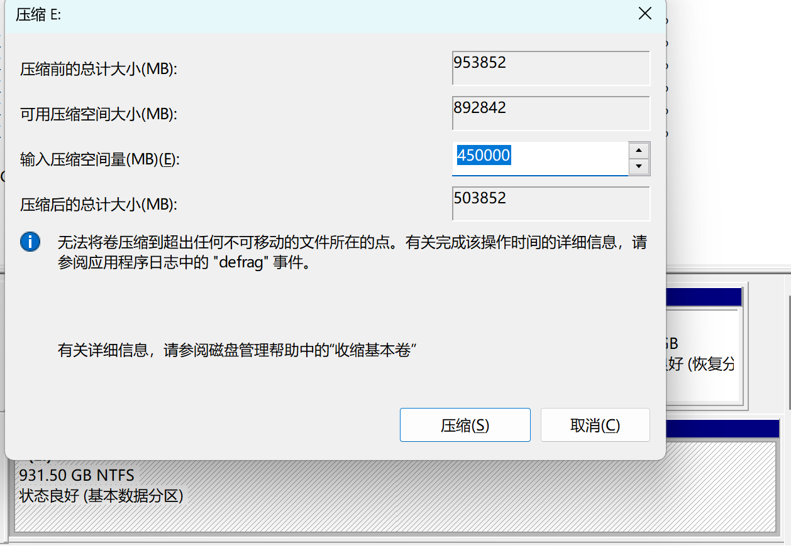
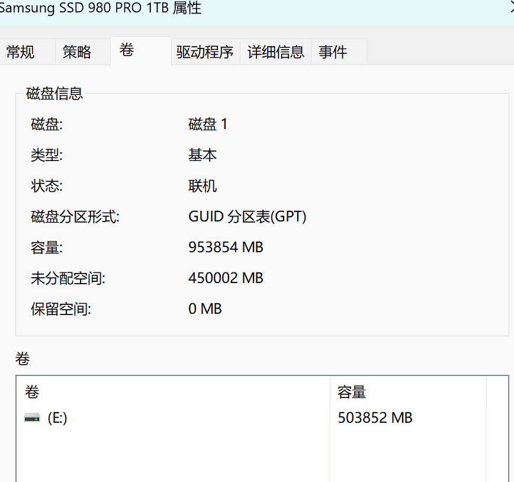
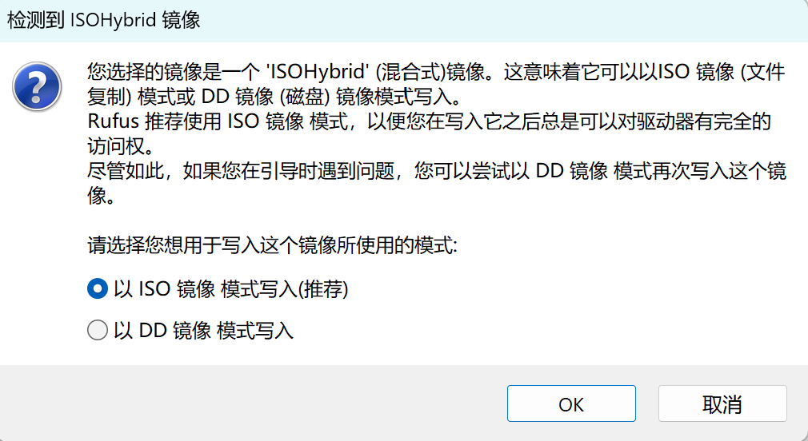

import { LinkCard, CardGrid } from '@astrojs/starlight/components';

:::note[说明]

教学资源：[地址](https://ysyx.oscc.cc/docs/#%E6%95%99%E5%AD%A6%E8%B5%84%E6%BA%90)

| 预学习阶段 | 2 | https://ysyx.oscc.cc/docs/2306/preliminary/0.2.html |
| --- | --- | --- |

这篇为我在该阶段的笔记，可能包含一些错误和问题的解答。
:::

## 卸载 Ubuntu

因为我的版本是 Ubuntu 20.04 ，防止可能产生的问题，于是我在双系统下卸载 Ubuntu 。

### 步骤一：调整开机启动项位置


1. 开机进入 BIOS 设置：在电脑还未亮之前，狂按 F2 (不同电脑可能不同)，然后进入 BIOS 系统设置。
2. 找到启动项，找到 Windows 启动项，将其调整到第一启动项。（我这里按 F6 ）

:::note[不同品牌电脑 BIOS 进入]
- 联想笔记本：F2或F12（部分电脑需要按住 Fn 键）
- 华硕笔记本：Esc
- 华为笔记本：F12
- 惠普笔记本：F9
:::

### 步骤二：删除 Ubuntu 分区

:::tip[参考资料]
1. [使用DiskGenius删除Ubuntu分区](https://blog.csdn.net/qq_42257666/article/details/120721561)
2. [用磁盘管理直接删除](https://blog.csdn.net/m0_69251699/article/details/128874906)
:::

我选择方法 2 ，打开系统的“磁盘管理”，确定 Ubuntu 所在的分区，右键删除卷。主要的判别方法是：
1. 之前安装时分配的磁盘和空间大小
2. 没有写着 C、D、E、F 盘符的分区
3. 右键删除卷时，弹出的提示（如图）


### 步骤三：删除 Ubuntu EFI 文件

win + r，输入`cmd`进入命令窗口。

```cmd
diskpart
```

在弹出的窗口（如果有）中输入：

```cmd
list disk
```

找到 Windows 的 EFI 分区所在的磁盘（大概率是磁盘 0），输入：

```cmd
select disk 0
list partition
```
找到一个大小约 260M 的分区然后选择它，我这里是分区0，所以输入：

```cmd
select partition 0
```

分配盘符，不要和你已有的盘符重复，如C、D、E、F，我这里选择 P ：

```cmd
assign letter=P
```

系统（win11下面有个搜索框）里找到记事本，用管理员权限打开，上面“文件->打开”，找到 P 盘，找到 Ubuntu 文件夹，右键删除它。


最后，输入下面命令行，恢复回去。

```cmd
remove letter=P
```

## 安装 Ubuntu 22.04

:::caution[装Ubuntu之前]
只有一台电脑，但需要使用 Ubuntu ，有安装双系统和虚拟机两种方法。虚拟机就是能同时跑两个系统，吃电脑性能；双系统是在开机时决定进入哪个操作系统。根据自身需求决定，我这里介绍双系统的安装方法（CSDN 有大量虚拟机的教程，双系统较少）。

我这里使用的是 64 位 Windows 11 操作系统。在安装之前请自查电脑配置是否适合装双系统，如 32 位的 Windows 就不合适。
:::

### 下载镜像和镜像安装工具

下载镜像：[官网地址](https://releases.ubuntu.com/jammy/)

下载的镜像后缀为.iso，我下载的为`ubuntu-22.04.5-desktop-amd64.iso`。

:::tip
1. 开梯下载会更快一点
2. 占用空间比较大（4.4G），如果 C 盘满了，可以更改浏览器下载的路径
:::

我们可以趁下载镜像的功夫，再去下载一个制作启动盘的工具：[rufus](https://rufus.ie/zh/)，它是[开源](https://github.com/pbatard/rufus/releases/tag/v4.5)的。当然也有不同的教程采用不同的工具，例如 [win32diskimager](https://www.bilibili.com/video/BV1554y1n7zv/)、[Ventory](https://blog.csdn.net/qq_59001382/article/details/142951549)等。

### 磁盘分区

有两种方案：
方案一包含四个分区：
- efi：500M Ubuntu 引导区
- swap：交换区，休眠和数据溢出时存储的地方，依据物理内存分配（系统中查看），8G-10G，16G-16G，32G及以上-24G
- ext4：根目录，存放系统文件（理解为 C 盘），尝鲜级（不安装 CUDA 之类的）20G，一般 100G 以上。
- ext4：home目录，存放用户文件（理解为 D 盘），**重装系统时可以只覆盖其他分区，本分区内容能保存下来**，我这里也计划 100G 以上。

（重度需求，跑神经网络数据集等的 500 + 500G）

方案二仅有三个分区，将后两个分区合并，适合空间紧张的朋友。

打开“磁盘管理”，选择一个磁盘右键点“压缩卷”，设置所需要的大小，压缩得到未分配的空间。



:::note[可压缩空间的大小远小于磁盘的剩余空间]
打个比方就是瓶子里装石头，能利用的空间就只剩下最上面空出的空间，石头和石头之间的空隙并不能利用上。

解决方法有：1. 重新整理磁盘，把数据放一起去；2.把磁盘中数据导入到 U 盘，格式化磁盘，再把 U 盘中数据导回到磁盘。
:::

这时顺便看一下磁盘分区类型：右键刚刚压缩卷的那个磁盘（那一行最左侧的灰色区域），选择“属性”，点击“卷”，就能确定是 MBR 分区还是 GPT 分区。

:::note[关于分区类型]
我这里是装了一块新的硬盘，它的分区类型需要和电脑的匹配，所以都一样。当然也可以是直接在“系统信息”中查看“BIOS模式”。BIOS 引导模式和分区类型一一对应。

**MBR 采用 legacy 模式，GPT 采用 UEFI 模式**。MBR 属于比较老的电脑了，现在新电脑都普遍采用 GPT 分区类型。 
:::



### 制作启动盘

:::danger[特别注意]
1. 用来制作启动盘的 U 盘、移动硬盘等务必将内容提前备份，制作系统盘会将它清空。
2. 确保这段时间电脑不会没电，不然你的 U 盘可能就废了。
:::

准备一个内存够大（8G以上）的 U 盘，**注意备份**，因为制作系统盘会清除里面的内容。如果 U 盘上有物理的写保护滑块，请将它滑到 unlock 状态。

打开 Rufus，选择下载好的镜像文件，选择 U 盘作为启动盘。
- 在"分区方案和目标系统类型"选项中，选择刚刚我们查看的分区形式。我这里是 GPT 。
- 在"文件系统"和"簇大小"选项中，保持默认设置通常就可以。
- 在"新卷标"中，你可以自定义U盘的卷标名称，也可以保持默认。
- 勾选"快速格式化"和"创建一个启动盘使用ISO镜像"选项，这也是默认的。

点击“开始”，它可能会弹出好几个警告，下面这个窗口如图选择第一个，之后的警告都是说会使你磁盘内容丢失、多分区磁盘其他分区也会丢失等等，**注意好备份**，一直“OK”“是”“确定”就行。



时间有点长，保持电脑有电。


<LinkCard title="项目首页" description="一生一芯跟学笔记" href="../ysyx" />
<CardGrid>
<LinkCard title="上一篇" description="预学习1：如何科学地提问" href="../ysyx" />
</CardGrid>